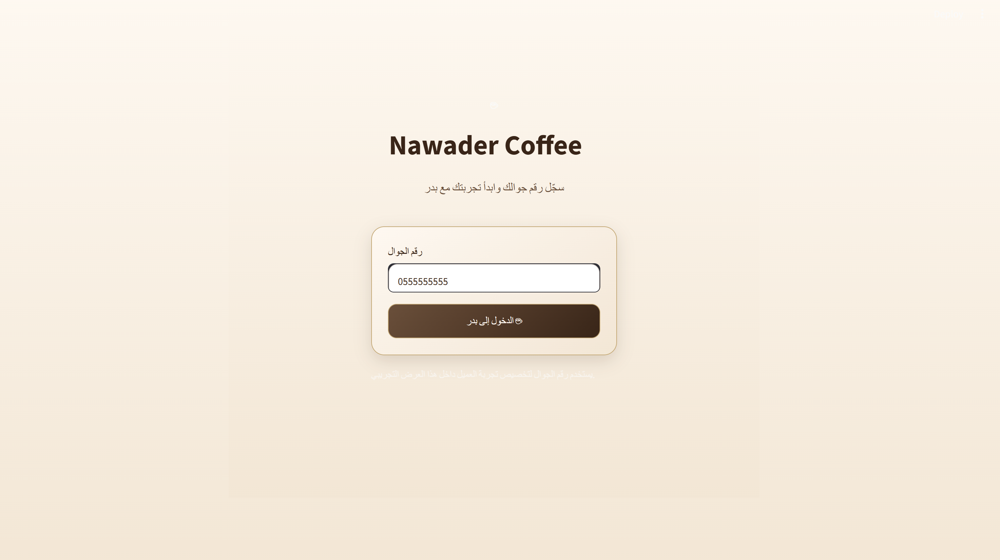
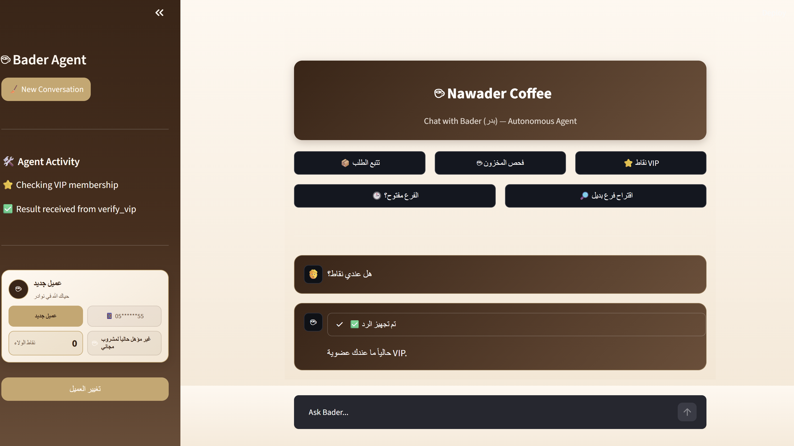
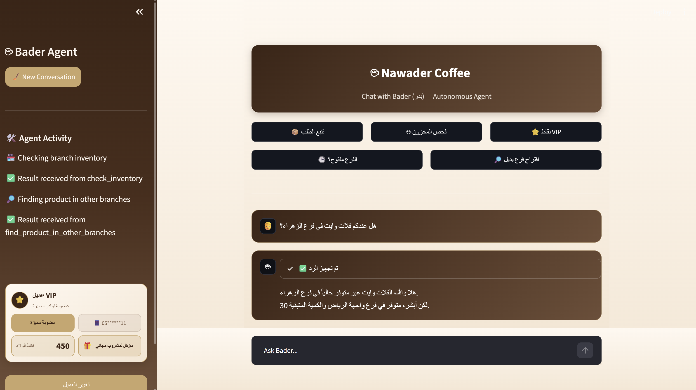
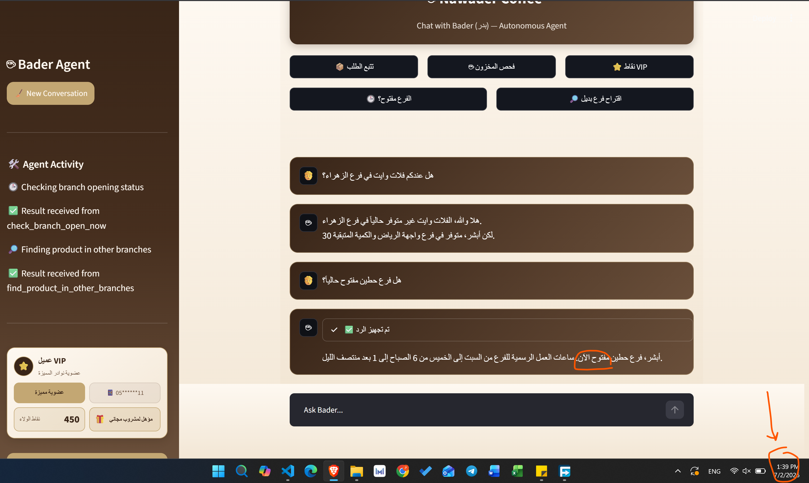
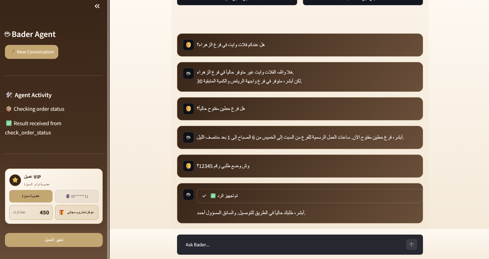

# Nawader Coffee Autonomous AI Agent ☕

## Overview

Bader (بدر) is an autonomous customer-service agent for Nawader Coffee.

The project uses FastAPI, LangChain, ChatGroq, and Streamlit to:

- Check order status
- Check branch inventory
- Verify VIP membership and loyalty points
- Check free-drink eligibility
- Check whether a branch is open now 
- Recommend alternative branches when an item is unavailable
- Maintain multi-turn conversation context
- Personalize the experience using a Saudi mobile number

Bader speaks in a natural Saudi dialect and follows strict business rules to reduce hallucination.

---

## Technology Stack

- Python
- FastAPI
- Streamlit
- LangChain
- ChatGroq
- Groq API
- Pydantic
- Requests
- JSON mock data
- HTML and CSS

---

## Project Structure

```text
project/
│
├── api/
│   ├── main.py
│   └── data/
│       ├── orders.json
│       ├── inventory.json
│       └── vip_customers.json
│
├── agent/
│   ├── agent.py
│   └── tools.py
│
├── services/
│   ├── __init__.py
│   └── customer_service.py
│
├── assets/
│   └── style.css
│
├── screenshots/
│   └── chat.png
│
├── app.py
├── prompt.txt
├── requirements.txt
├── README.md
├── .env.example
└── .gitignore
```

---

## Installation

### 1. Create a virtual environment

Windows:

```bash
python -m venv .venv
.venv\Scripts\activate
```

macOS/Linux:

```bash
python -m venv .venv
source .venv/bin/activate
```

### 2. Install dependencies

```bash
pip install -r requirements.txt
```

### 3. Create the environment file

Create a file named `.env` in the project root:

```env
GROQ_API_KEY=your_groq_api_key_here
```

Do not upload or share the real `.env` file.

---

## Run the Project

Open two terminals in the project folder.

### Terminal 1 — FastAPI Backend

```bash
uvicorn api.main:app --reload
```

Backend:

```text
http://127.0.0.1:8000
```

Swagger documentation:

```text
http://127.0.0.1:8000/docs
```

### Terminal 2 — Streamlit Frontend

```bash
streamlit run app.py
```

Frontend:

```text
http://localhost:8501
```

---

## API Endpoints

### Order Status

```http
GET /orders/{order_id}
```

### Branch Inventory

```http
GET /inventory/{branch_name}/{item_name}
```

### VIP Verification

```http
GET /vip/{phone_number}
```

### Alternative Branch Recommendation

```http
GET /recommendations/inventory/{item_name}
```

---

## LangChain Tools

The agent uses:

- `check_order_status`
- `check_inventory`
- `verify_vip`
- `check_branch_open_now`
- `find_product_in_other_branches`

All tools access backend data through HTTP requests only.

---

## Model Selection

The project uses:

```text
openai/gpt-oss-120b
```

through ChatGroq.

It was selected because it provides:

- Strong tool-calling performance
- Good Arabic conversation quality
- Fast inference through Groq
- Reliable behavior for agent workflows

Model setting:

```python
temperature=0.3
```

The low temperature improves consistency and reduces hallucination.

---

## Test Queries

### Order Status

```text
وش وضع طلبي رقم 12345؟
```

Expected tool: `check_order_status`

### Inventory

```text
هل عندكم سبانش لاتيه في فرع حطين؟
```

Expected tool: `check_inventory`

### VIP

```text
هل عندي نقاط؟
```

Expected tool: `verify_vip`

### Open Now

```text
هل فرع حطين مفتوح حالياً؟
```

Expected tool: `check_branch_open_now`

### Alternative Branch

```text
هل عندكم فلات وايت في فرع الزهراء؟
```

Expected tools:

- `check_inventory`
- `find_product_in_other_branches`

---

## Customer Test Numbers

| Phone Number | Customer Type | Points | Free Drink |
|---|---|---:|---|
| `0511111111` | VIP | 450 | Yes |
| `0522222222` | VIP | 120 | No |
| `0599999999` | Registered non-VIP | 0 | No |
| `0555555555` | New customer | 0 | No |

---

## Main Features

- Saudi-dialect persona
- Tool-calling agent
- Multi-turn session memory
- Customer identification by phone number
- VIP status and loyalty points
- Current branch-opening logic
- Alternative branch recommendation
- Quick-start buttons
- Agent Activity panel
- Branded Streamlit interface
- Input validation and missing-data handling


## Screenshot




    



---

